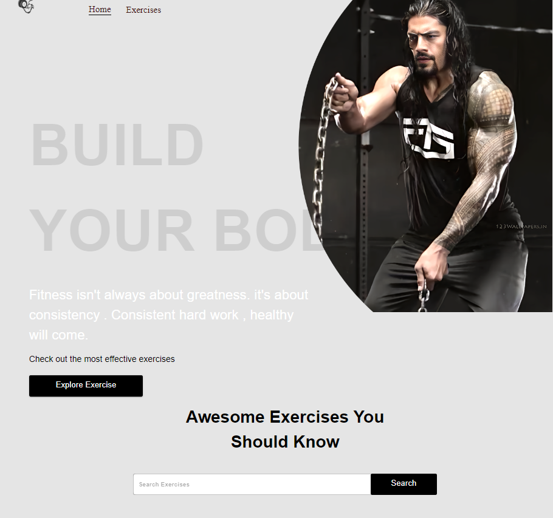

# Gym Application

Welcome to the Gym Application! This application is designed to help users track their fitness journey, manage workouts, and stay motivated to achieve their fitness goals.

## Features

- **Dashboard:** Upon logging in, users are greeted with a personalized dashboard showcasing their recent activities, workout summaries, and progress.

- **Goal Setting:** Users can set specific fitness goals, such as weight loss, muscle gain, or running distance. The app will provide reminders and progress tracking for these goals.

- **Challenges and Achievements:** Users can participate in fitness challenges organized by the app or create their own challenges. Completing challenges unlocks achievements and rewards.

## Installation

1. Clone this repository: `git clone https://github.com/yourusername/gym-application.git`
2. Navigate to the project directory: `cd gym-application`
3. Install dependencies: `npm install`
4. Configure database settings in `config.js`
5. Start the application: `npm start`

## Technologies Used

- Frontend: HTML, CSS, JavaScript, ReactJS , MUI
- RAPID API

## Screenshots

